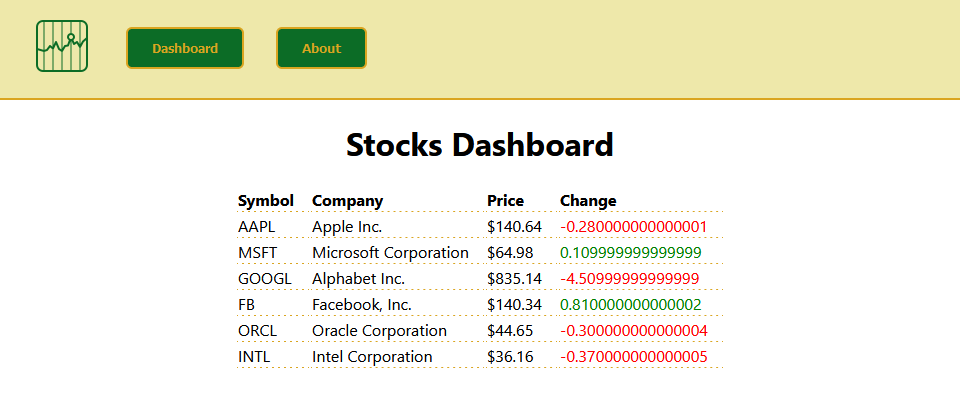

<h1 align="center">Welcome to react_router_stock_app!</h1>

  
  
  

> Per Scholas - Week 12 - "multi-page" React - Assignment: React Router Stock App

> A React app that shows stock information. It features a dashboard that summarizes the stocks, individual stock pages, and an about page that describes the app.

## Demo

### 🏠 [Homepage](https://github.com/DrAcula27/react_router_stock_app#readme)

## Author

👤 **Danielle Andrews**

- Github: [@DrAcula27](https://github.com/DrAcula27)
- LinkedIn: [@daniellerandrews](https://linkedin.com/in/daniellerandrews)

## Project Details

**This project was bootstrapped with [Create React App](https://github.com/facebook/create-react-app).**

Create a React app that displays stock information.

### Required Routes

| Route             | Renders              | Component |
| ----------------- | -------------------- | --------- |
| `/`               | "All Stocks"         | Dashboard |
| `/about`          | "About Page"         | About     |
| `/stocks/:symbol` | "Info on that stock" | Stock     |

### Required Features

1. Navigation
   - No matter what route the user is visiting, they should always see a navigation bar at the top of the window.
   - It should contain links to the "Dashboard" and "About" pages.
1. Dashboard
   - If a user visits `/stocks` or clicks "Dashboard" in the navigation bar, they should be directed to the dashboard page.
   - This page should list all of the stocks, specifically their `name` and `symbol`.
   - These stocks should be pulled from `stock-data.js`.
1. About
   - If a user clicks on "About" in the navigation bar, they should be directed to the about page.
   - This is just a static page that displays a description of the app.
1. Stock
   - If a user clicks on one of the stocks listed in the Dashboard view, they should be directed to an individual stock show view.
   - This view should display all of that stock's attributes.

## Available Scripts

In the project directory, you can run:

### `npm start`

Runs the app in the development mode.\
Open [http://localhost:3000](http://localhost:3000) to view it in your browser.

The page will reload when you make changes.\
You may also see any lint errors in the console.

### `npm test`

Launches the test runner in the interactive watch mode.\
See the section about [running tests](https://facebook.github.io/create-react-app/docs/running-tests) for more information.

### `npm run build`

Builds the app for production to the `build` folder.\
It correctly bundles React in production mode and optimizes the build for the best performance.

The build is minified and the filenames include the hashes.\
Your app is ready to be deployed!

See the section about [deployment](https://facebook.github.io/create-react-app/docs/deployment) for more information.

### `npm run eject`

**Note: this is a one-way operation. Once you `eject`, you can't go back!**

If you aren't satisfied with the build tool and configuration choices, you can `eject` at any time. This command will remove the single build dependency from your project.

Instead, it will copy all the configuration files and the transitive dependencies (webpack, Babel, ESLint, etc) right into your project so you have full control over them. All of the commands except `eject` will still work, but they will point to the copied scripts so you can tweak them. At this point you're on your own.

You don't have to ever use `eject`. The curated feature set is suitable for small and middle deployments, and you shouldn't feel obligated to use this feature. However we understand that this tool wouldn't be useful if you couldn't customize it when you are ready for it.

## Learn More

You can learn more in the [Create React App documentation](https://facebook.github.io/create-react-app/docs/getting-started).

To learn React, check out the [React documentation](https://reactjs.org/).

### Code Splitting

This section has moved here: [https://facebook.github.io/create-react-app/docs/code-splitting](https://facebook.github.io/create-react-app/docs/code-splitting)

### Analyzing the Bundle Size

This section has moved here: [https://facebook.github.io/create-react-app/docs/analyzing-the-bundle-size](https://facebook.github.io/create-react-app/docs/analyzing-the-bundle-size)

### Making a Progressive Web App

This section has moved here: [https://facebook.github.io/create-react-app/docs/making-a-progressive-web-app](https://facebook.github.io/create-react-app/docs/making-a-progressive-web-app)

### Advanced Configuration

This section has moved here: [https://facebook.github.io/create-react-app/docs/advanced-configuration](https://facebook.github.io/create-react-app/docs/advanced-configuration)

### Deployment

This section has moved here: [https://facebook.github.io/create-react-app/docs/deployment](https://facebook.github.io/create-react-app/docs/deployment)

### `npm run build` fails to minify

This section has moved here: [https://facebook.github.io/create-react-app/docs/troubleshooting#npm-run-build-fails-to-minify](https://facebook.github.io/create-react-app/docs/troubleshooting#npm-run-build-fails-to-minify)

## Tech Stack

This project uses the following:

- **E** -  [Express](https://expressjs.com/)
- **R** -  [React](https://reactjs.org/)
- **N** -  [Node](https://nodejs.org/en/)

## Attributions

-

## Show Your Support

Give a ⭐️ if you liked this project!
